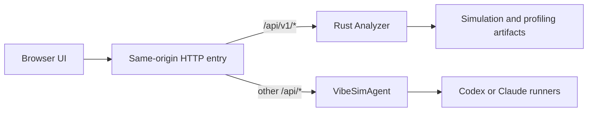

<div align="center">


<h1>VibeSim UI</h1>

<p><strong>Understand serving performance. Follow the evidence.</strong></p>
<p>Simulation · Timing prediction · Kernel profiling · Agent investigation</p>

<p>
  <a href="#quickstart"><strong>Get started</strong></a> &nbsp;·&nbsp;
  <a href="#what-you-can-do">Explore features</a> &nbsp;·&nbsp;
  <a href="#production-build">Deploy</a> &nbsp;·&nbsp;
  <a href="#documentation">Documentation</a>
</p>

<p>
  
  
  
</p>

</div>

---

VibeSim UI brings simulation results, timing predictions, kernel measurements,
and Agent conversations into one browser workspace. Compare configurations,
follow a bottleneck through the cost tree, and attach the evidence to a
conversation without losing the result you were inspecting.

## What you can do

| Explore | What you can do |
| --- | --- |
| **Serving configurations** | Explore sweep heatmaps and select runs by workload and deployment coordinates. |
| **Simulation results** | Navigate cluster, pool, worker, iteration, and kernel views; inspect timelines, utilization, and optimality. |
| **Timing predictions** | Explore offline timing predictions through model and kernel cost trees. |
| **Kernel measurements** | Browse kernel profile curves, measurement summaries, and plots. |
| **Agent conversations** | Start or resume conversations, attach selected Analyzer evidence, and navigate back from cited results. |

The Agent pane can be docked, resized, or expanded. Conversations retain their
history and reconnect to running turns after a refresh. Dark, light, and paper
themes support different reading environments.

---

## Quickstart

Choose the fixture-backed UI to explore the interface, or the complete workspace
to work with live results and Agent conversations. Both paths require **Node.js 22
and npm**.

### Explore the included results

This path needs no simulator build, GPU, Docker image, or Agent credentials.
It uses checked-in Analyzer artifacts; Agent execution requires the live stack.

```bash
git clone https://github.com/SyFI-VibeSim/VibeSimUI.git
cd VibeSimUI/app
npm ci

# Pick an unused port; override UI_PORT on shared hosts if necessary.
UI_PORT=${UI_PORT:-$((60030 + 3 * $(id -u)))}
npm run dev -- --port "$UI_PORT" --strictPort
```

Open the localhost URL printed by Vite. The default binds to `127.0.0.1`.
Choose a port between 1024 and 65535; `--strictPort` fails on a conflict instead
of silently choosing another port. This server stays in the foreground; use
`tmux` when it needs to outlive your terminal.

### Work with live results and Agents

[VibeSimWorkspace](https://github.com/SyFI-VibeSim/VibeSimWorkspace) pins compatible
revisions of the simulator/Analyzer, Agent backend, UI, and introduction site.
Install the [host prerequisites](https://github.com/SyFI-VibeSim/VibeSimWorkspace/blob/main/reproduce.md#host-setup)
first, including Python 3, uv, Rust, just, and native build tools. Agent execution
also needs Docker and an authenticated Codex or Claude installation.

```bash
git clone --recurse-submodules \
  https://github.com/SyFI-VibeSim/VibeSimWorkspace.git vibesim-workspace
cd vibesim-workspace
just setup-env

# Run builds in a persistent shell.
tmux new-session -s vibesim-setup
# Inside tmux, from the workspace root:
source .env
just build
just build-runner-image
just start
just smoke-local
```

Open the URL printed by `just start`. It starts one UI, Agent backend, and Analyzer
in workspace-specific tmux sessions and waits for the application routes to respond.
`just services-status` inspects them; `just stop` stops those three sessions.

The workspace assigns three ports starting at `60030 + 3 × UID` and checks for
conflicts. Set `VIBESIM_PORT_BASE` in the local `.env` when using another port
range or running multiple workspaces. `.env` also contains absolute scratch and
uv-cache paths; root `just` loads it automatically. See the
[setup guide](https://github.com/SyFI-VibeSim/VibeSimWorkspace/blob/main/reproduce.md)
for credentials, image configuration, GPU checks, logs, and troubleshooting.

---

## Production build

Build a live application from `app/`:

```bash
npm ci
VITE_ANALYZER_API_BASE=/api/v1/ npm run build
```

The output is `app/dist/`.

> [!IMPORTANT]
> Set `VITE_ANALYZER_API_BASE` **at build time**. Without it, the default build
> reads bundled fixtures. Changing the static server's environment does not
> change an already-built application.

Serve `dist/` through your HTTP server and route API requests on the same origin:

| Route | Destination |
| --- | --- |
| `/api/v1/*` | Rust Analyzer: result catalogs, descriptors, payloads, plots, and hardware data. |
| Other `/api/*` | VibeSimAgent: workspaces, conversations, turns, and job lifecycle. |
| Application assets | Files from `app/dist/`. |

The Vite proxy configuration is for development; it is not bundled into `dist/`.
Preserve streaming responses for Agent turns. When exposing Agent APIs beyond
localhost, configure `VIBESIM_API_TOKEN` and send it as a bearer token from API
clients. Runner networking and authentication are documented in the
[Agent setup](https://github.com/SyFI-VibeSim/VibeSimAgent#run).

---

## How the pieces fit



**Analyzer owns result data.** The UI reads its versioned resources through
`AnalyzerRepository` adapters rather than parsing files or Parquet in components.
Missing, failed, unavailable, and incompatible results remain explicit states.

**The Agent owns execution and conversation state.** Its job catalog contributes
ownership and lifecycle information; the UI joins it to Analyzer results using
stable resource IDs. Agent messages can cite selectable evidence that opens the
corresponding result view.

TanStack Query manages server state. Zustand holds local selection and layout
state. React, TypeScript, MUI, ECharts, and Canvas provide the application and
visualization layers.

---

## Development

Run these commands from `app/`:

| Command | Purpose |
| --- | --- |
| `npm run dev` | Develop against a running Analyzer and Agent backend through the Vite proxies. Start them with `just start` from the workspace root. |
| `npm run test:unit` | Run adapter, calculation, routing, and interaction tests. |
| `npm run typecheck` | Check application and browser-test TypeScript. |
| `npm run lint` / `npm run format:check` | Check source quality and formatting. |
| `npm run build` | Typecheck and bundle. |

<details>
<summary><strong>Manual proxy and remote-access configuration</strong></summary>

For a manually started live dev server, set `ANALYZER_PROXY_TARGET` and
`CONVERSATION_PROXY_TARGET` to your selected backend addresses. Vite otherwise
uses ports 8787 and 8765. `VIBESIM_UI_HOST` controls the bind address;
`VIBESIM_UI_ALLOWED_HOSTS` supplies an explicit hostname allowlist for remote access.
The workspace `just start` command wires these values together.

</details>

<details>
<summary><strong>Browser tests and CI checks</strong></summary>

Browser checks run the functional suite on desktop Chromium and responsive cases
at 390px. Install the
browser before the first run:

```bash
npx playwright install --with-deps chromium
# Select a free port so tests cannot attach to another user's development server.
PLAYWRIGHT_PORT=63042 npm run test:e2e
```

Failure traces, screenshots, videos, and reports are saved under
`.artifacts/playwright-test/`. The [CI workflow](.github/workflows/ci.yml) runs
lint/type checks, fixture validation, unit tests, a live production bundle,
and browser tests. Formatting checks are optional local tools; browser
errors and uncaught exceptions fail tests, while warnings do not. The suite
checks keyboard and navigation behavior without full-page WCAG audits. Run the
relevant checks before submitting changes; keep fixture data bounded and preserve
its provenance.

</details>

---

## Documentation

See the [documentation index](docs/README.md) for contract versions and source ownership.

| Guide | Covers |
| --- | --- |
| [Workspace setup](https://github.com/SyFI-VibeSim/VibeSimWorkspace/blob/main/reproduce.md) | Reproducible installation, services, Docker runners, and smoke checks. |
| [Frontend architecture](docs/frontend-architecture.md) | Code ownership, state boundaries, and rendering contracts. |
| [Analyzer data protocol](docs/data-protocol.md) | Catalogs, resource identities, and payload adapters. |
| [Agent–Analyzer integration](docs/inquiry-wiring.md) | Workspaces, conversations, execution, and result relationships. |
| [Evidence citations](docs/citation-dsl.md) | Selectable evidence and navigation from Agent messages. |
| [Themes](docs/themes.md) | Theme selection and shared visual tokens. |

<details>
<summary><strong>Repository layout</strong></summary>

```text
VibeSimUI/
├── app/                   Application, unit/browser tests, and build configuration
├── docs/                  Architecture and data contracts
├── fixtures/analyzer-v1/  Bounded Analyzer artifacts for development and tests
└── scripts/               Fixture extraction and validation
```

</details>
